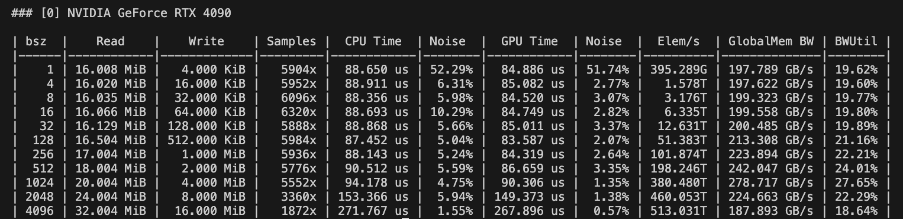
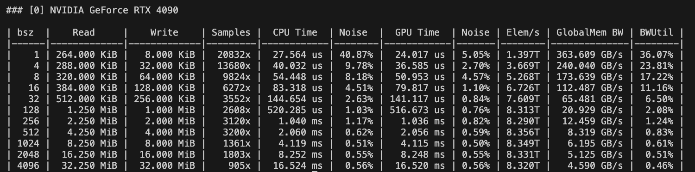
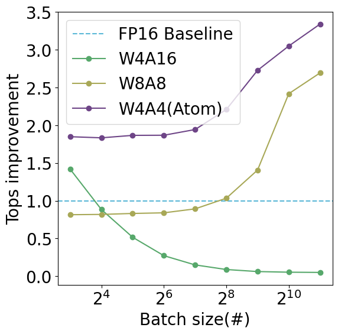

# Atom: Baseline Kernel Evaluations
## Environment Setup
We use [NVBench](https://github.com/NVIDIA/nvbench.git) to evaluate the kernel performance and we need [libTorch](https://pytorch.org/) with `_GLIBCXX_USE_CXX11_ABI = 1` to make baselines compatible with NVBench. Follow the instructions below to setup the environment.
```
wget https://download.pytorch.org/libtorch/cu121/libtorch-cxx11-abi-shared-with-deps-2.1.2%2Bcu121.zip
unzip libtorch-cxx11-abi-shared-with-deps-2.1.2+cu121.zip
mv libtorch /PATH_TO_ATOM/kernels/3rdparty/
```
Use the following instructions or scripts `build.sh` to build the baseline benchmark.
```
mkdir build
cd build
# Fill in your libtorch path
cmake .. -DCMAKE_PREFIX_PATH=/PATH_TO_ATOM/kernels/3rdparty/libtorch
make -j
```
## Result
8-bit Weight-activation Quantization (SmoothQuant) and 4-bit Weight-only Quantization (AWQ) are evaluated in CUDA 12.1 to maximize their performance. Note that `Elem/s` denotes the computation throughput.

W8A8 Evaluation:


W4A16 Evaluation:


We also use PyTorch Extension to evaluate the performance of PyTorch API Kernel. Baselines are installed according to their official codebases. Please refer to this [notebook](./python-api.ipynb) to check the results. Below is a sample figure:
